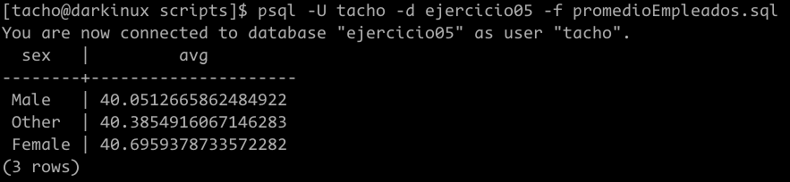

# Ejercicio 05
Estudiante: Silva, Ignacio 

Universidad Católica

Asignatura: Bases de datos I

Docente: Jorge Martínez

Fecha: 15 de septiembre de 2025

# Crear la tabla Empleados en PostgreSQL
Para esto, decidí crear un scripts que cree la tabla y ejecute comandos de `psql` dentro del mismo script para cargar los datos de `Empleados.csv`.
## Anlálisis del archivo `Empleados.csv`
Para esto, debemos enteneder que los archivos `.csv` tienen dos partes
* Header
* Contenido 

Con esto en mente, resta aclarar que para cargar o importar los datos desde un archivo de este estilo es necesario haber creado en nuestra BD una tabla que sea compatible con el mismo. Es poreso que se debe realizar un análisis

### Header de `Empleados.csv`
```csv
,Name,Address,Salary,DOJ,DOB,Age,Sex,Dependents,HRA,DA,PF,Gross Salary,Insurance,Marital Status,In Company Years,Year of Experience,Department,Position
```
la coma al inicio nos dice que irá un id autoincremental en ese lugar. Además mirando esto, llegue a extraer la siguiente información 


## Crear la BD `ejercicio05` y la tabla `empleados`
Ahora que disponemos de la información podemos proseguir con el DDL
### Crear la BD
```sql
DROP DATABASE IF EXISTS ejercicio05;
CREATE DATABASE ejercicio05;
\c ejercicio05; 
```
comandos como `\c` que son del entorno de `psql` estan permitidos en los scripts `.sql` que ejecuta postgres siempre que los ejecutemos con la opción `-f`

En este caso `\c` ingresa a la BD `ejercicio05`

### Crear tipos
Me pareció oportuno definir tipos y su dominio ya que en el archivo `Empleados.csv` hay varios de los cuales se pueden considerar de multiple opción. Lo hice de la siguiente manera: 

```sql
CREATE TYPE genero AS ENUM ('Male', 'Female', 'Other');
CREATE TYPE seguro AS ENUM ('None', 'Both', 'Life', 'Medical');
CREATE TYPE estado_civil AS ENUM ('Divorced', 'Widowed', 'Single', 'Married');
```

### Crear la tabla empleados
Ahora si, podemos definir la tabla con el listado de todos los atributos que obtuvimos del análisis del paso anterior. 

```sql
CREATE TABLE EMPLEADOS(
    id_empleado SERIAL PRIMARY KEY,
    name varchar(50),
    adress varchar(50),
    salary decimal, 
    DOJ date,
    DOB date,
    age int, 
    sex genero,
    dependents int,
    HRA decimal,
    DA decimal, 
    PF decimal,
    gress_salary decimal,
    insurance seguro, 
    marital_status estado_civil,
    in_company_years int,
    years_of_experiencie int, 

    --estos dos últimos también podrían ser un tipo dentro de nuestra base de datos. Los manejo como varchar por mas simplicidad.
    departament varchar(50),
    position varchar(50)
);
```

### Cargar los datos desde `Empleados.csv`
Para terminar la primer parte del ejercicio, solo resta importar los datos. Esto lo hacemos con el siguiente comando dentro del mismo script.

```sql
\copy EMPLEADOS FROM 'Empleados.csv' WITH (FORMAT CSV, HEADER);
```
Cabe resaltar que `\copy` es un comando del entorno `psql`.

#### Forma genérica
```sql
\copy nombre_de_la_tabla FROM 'ruta/del/archivo' WITH (FORMAT CSV, HEADER);
```
### Ejecutar el script
Ahora que tenemos todo el scritp creado, solo resta ejecutar. 


#### Comprobar si los datos fueron cargados
Podemos entrar a la bd con mediante `psql` y hacer una consulta. Para esto, hay que ejecutar el siguiente comando: `psql -U nombre_usuario -d base_de_datos` y luego hacer una consulta.


# Sentencias SQL

La siguiente parte del ejercicio trata sobre relizar las siguientes consultas a la base de datos: 
*  Listado de todos los empleados detallando nombre, dirección, edad, sexo
y estado civil, mayores a 40 años.
* Listado de todos los empleados detallando nombre, dirección, edad, sexo
y estado civil, menores a 40 años y cuyo estado civil sea “soltero”.
* Cantidad total de empleados por departamento.
* Cantidad total de empleados por departamento, discriminados por sexo.
* Promedio de edad de los empleados, discriminados por sexo.

Vamos a crear un script `.sql` para cada una

## Listado de empleados mayores a 40 años
Es una consulta sencilla en que tenemos que usar `SELECT` ... `FROM` ... `WHERE`. Mi script quedó de la siguiente manera

```sql
--Entrar a la BD
\c ejercicio05;
SELECT name, adress, age, sex, marital_status 
FROM empleados 
WHERE age > 40;
```
Luego lo ejecute usando 

```bash
psql -U tacho -d ejercicio05 -f mayores40.sql
```
y el resultado fue el siguiente: 


## Listado de empleados menores a 40 años y solterios
Usaré la misma estructura pero ahora acompañado de un  `AND` para filtrar por las dos condiciones. 

```sql
--Entrar a la BD
\c ejercicio05;

SELECT name, adress, age, sex, marital_status 
FROM empleados 
WHERE marital_status = 'Single' AND age < 40;

```
Luego lo ejecute usando 

```bash
psql -U tacho -d ejercicio05 -f menores40.sql
```
y el resultado fue el siguiente: 


## Cantidad de empleados por departamento
En esta consulta, nos conviene dejar de lado el `WHERE` y usar `GRUOP BY` para agrupar a los empleados en función de su departamento. Además, debemos usar `COUNT(*)` para saber cuantos hay de cada grupo de la siguiente manera: 


```sql
--Entrar a la BD
\c ejercicio05;
Select departament, COUNT(*)
FROM EMPLEADOS
GROUP BY departament;
```
Luego lo ejecute usando 

```bash
psql -U tacho -d ejercicio05 -f cantidadEmpeadosDepto.sql
```
y el resultado fue el siguiente: 


## Cantidad de empleados por departamento y sexo
Es casi identica  a la anterior, solo que ahora debemos agrupar en función del departamento y el genero.


```sql
--Entrar a la BD
\c ejercicio05;

SELECT departament, sex, COUNT(*)
FROM EMPLEADOS
GROUP BY departament, sex;
```
Luego lo ejecute usando 

```bash
psql -U tacho -d ejercicio05 -f cantidadEmpeadosDeptoGender.sql
```
y el resultado fue el siguiente: 


## Promedio de edad de los empleados según el sexo.

Es similar a la anterior solo que en vez de usar `COUNT` vamos a usar `AVG(age)` con el fin de hacer el promedio de los generos


```sql
--Entrar a la BD
\c ejercicio05;

SELECT sex, AVG(age)
FROM empleados
GROUP BY sex;
```
Luego lo ejecute usando 

```bash
psql -U tacho -d ejercicio05 -f cantidadEmpeadosDeptoGender.sql
```
y el resultado fue el siguiente: 




