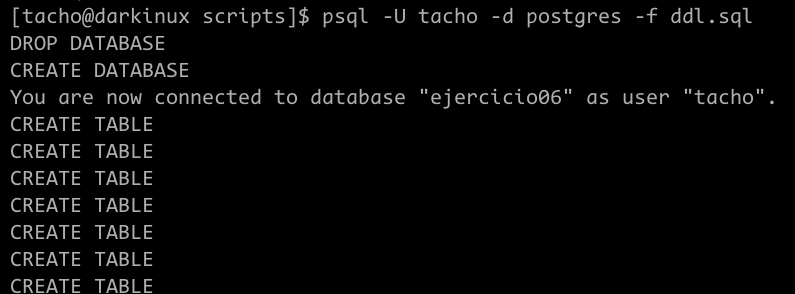
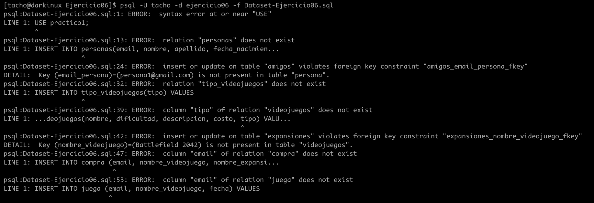
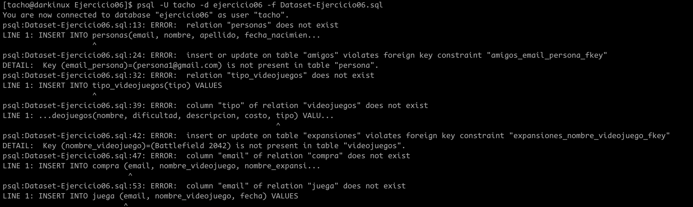
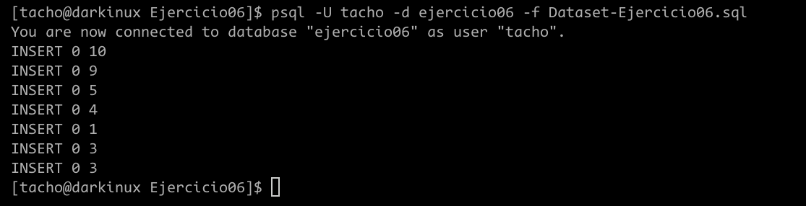
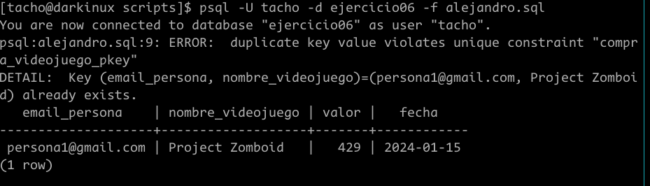
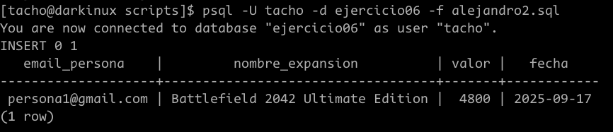
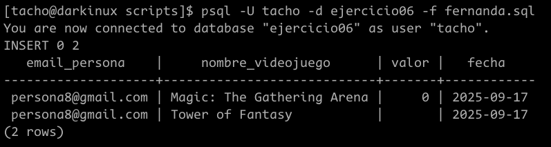

# Ejercicio 06
Estudiante: Silva, Ignacio 

Universidad Católica

Asignatura: Bases de datos I

Docente: Jorge Martínez

Fecha: 15 de septiembre de 2025

# Crear el dll de la base de datos del ejercicio
El primer paso para resolver este ejercicio es generar la base de datos.

```sql
DROP DATABASE IF EXISTS ejercicio06;

CREATE DATABASE ejercicio06;

\c ejercicio06;

CREATE TABLE persona (
    email varchar(50) PRIMARY KEY,
    nombre varchar(60),
    apellido varchar(60),
    fecha_nacimiento DATE,
    password TEXT NOT NULL
);
CREATE TABLE tipos_videojuegos(
    tipo varchar(60) PRIMARY KEY
);

CREATE TABLE videojuegos(
    nombre varchar(60) PRIMARY KEY,
    dificultad INT CHECK (dificultad >1 and dificultad<6),
    descripcion varchar(150),
    costo decimal, 
    tipo_videojuego varchar(60),
    FOREIGN KEY (tipo_videojuego) REFERENCES tipos_videojuegos(tipo)
);

CREATE TABLE EXPANSIONES(
    nombre varchar(60) PRIMARY KEY,
    nombre_videojuego varchar(60),
    costo decimal, 
    FOREIGN KEY (nombre_videojuego) REFERENCES videojuegos(nombre)
);

CREATE TABLE AMIGOS(
    email_persona varchar(50),
    email_amigo varchar(50),
    FOREIGN KEY (email_persona) REFERENCES persona(email),
    FOREIGN KEY (email_amigo) REFERENCES persona(email),
    PRIMARY KEY (email_persona, email_amigo)
);

CREATE TABLE COMPRA (
    id_compra SERIAL PRIMARY KEY,
    email_persona varchar(50),
    nombre_videojuego varchar(60),
    nombre_expansion varchar(60), 
    valor decimal, 
    fecha date, 
    FOREIGN KEY(email_persona) REFERENCES persona(email),
    FOREIGN KEY (nombre_expansion, nombre_videojuego) REFERENCES expansiones(nombre, nombre_videojuego),
    FOREIGN KEY (nombre_videojuego) REFERENCES videojuegos(nombre)
   );

CREATE TABLE juega(
    email_persona varchar(50),
    nombre_videojuego varchar(60),
    fecha date,
    FOREIGN KEY (email_persona) REFERENCES persona(email),
    FOREIGN KEY (nombre_videojuego) REFERENCES videojuegos(nombre),
    PRIMARY KEY (email_persona, nombre_videojuego, fecha)
);
```
## Crear la base de datos
Una vez creado el ddl, ejecuto el script con el siguiente comando `psql -U tacho -d postgres -F ddl.sql`



## Ejecutar scripts `Dataset-Ejercicio06.sql`
La primera vez que ejecute el script me dió los siguientes errores



Principalmente generado porque los nombres de las bd no coincidian.  a si que corregí solamente esto.




### Solucionar errores
Ahora que estamos conectados a la base de datos solo resta ir solucionando uno por uno los errores. 
Para resumir, todos eran por la direfencia de nombres, una vez solucionado eso, los errores desaparecioeron



## Gestiones
Con todo listo Solo hay que ir haciendo secuencialmente los hechos que se ennumeran en la letra

### Alejandro y Project Zomboid
Gracias a Alejandro me di cuenta de un error crucial en la tabla compra, es que, cuando ejecute el `INSERT` para cumplir con este paso, lo ejecute denuevo, y denuevo y siempre se agregaba, o sea que Alejandro estaba comprando el mismo juego muchas veces, lo que no puede ser. 
El problema es que al `id_compra` ser incremental, este generaba una nueva pk copmuesta siendo diferente de la anterior.

La primera solución que se me ocurrió fue eliminar este id y manejar una pk compuesta de `email_persona`, `nombre_videojuego`, `nombre_expansion`. Lo que también generaba un problema y es que Alejandro esta comprando solo el juego, mas no un dlc y al ambos campos ser parte de la pk, tienen la restricción de que no pueden ser nulos. Además podría darse el caso en el que la persona ya adquirió el juego y ahora está comprando un dlc, por lo que esta solución tampoco servía.

Llegue a la idea de normalizar la tabla compra y separarla en `compra_videojuegos` y `compra_expansiones`, además elimine el `id_compra` ya que lo único que hacía era generar duplicados.

#### Nuevo ddl
```SQL


CREATE TABLE compra_videojuego (
    id_compra SERIAL,
    email_persona varchar(50),
    nombre_videojuego varchar(60), 
    valor decimal, 
    fecha date, 
    FOREIGN KEY(email_persona) REFERENCES persona(email),
    FOREIGN KEY (nombre_videojuego) REFERENCES videojuegos(nombre),
    PRIMARY KEY(id_compra, email_persona, nombre_videojuego)
);

CREATE TABLE compra_expansiones (
    id_compra SERIAL,
    email_persona varchar(50),
    nombre_expansion varchar(60), 
    valor decimal, 
    fecha date, 
    FOREIGN KEY(email_persona) REFERENCES persona(email),
    FOREIGN KEY (nombre_expansion) REFERENCES expansiones(nombre),
    PRIMARY KEY(id_compra, email_persona, nombre_expansion)
);
```

#### Modificar dataset
Ahora que separe la tabla compra en dos, el dataset no funcionaba para esta tabla ya que tiene los siguientes inserts:

```SQL
INSERT INTO compra (email_persona, nombre_videojuego, nombre_expansion, valor, fecha) VALUES
('persona1@gmail.com', 'Project Zomboid', NULL, 429, '2024-01-15'),
('persona2@gmail.com', 'Tower of Fantasy', NULL, 0, '2024-02-10'),
('persona3@gmail.com', 'Battlefield 2042', 'Battlefield 2042 Ultimate Edition', 7400, '2024-03-22');
```
Así que los separé en los siguientes:
```SQL
INSERT INTO compra_videojuegos(email_persona, nombre_videojuego, nombre_expansion, valor, fecha) VALUES
('persona1@gmail.com', 'Project Zomboid', 429, '2024-01-15'),
('persona2@gmail.com', 'Tower of Fantasy', 0, '2024-02-10'),
('persona3@gmail.com', 'Battlefield 2042', 2600, '2024-03-22');

INSERT INTO compra_expansiones(email_persona, nombre_expansion, valor, fecha) VALUES
('persona3@gmail.com', 'Battlefield 2042 Ultimate Edition', 4800, '2024-03-22');
```

y ahora solo resta insertar en la compra videojuegos con el siguiente script que inserta el valor requerido para la compra y muestra la tabla según el email de Alejandro para comprar que se efectuaron los cambios: 

```SQL
\c ejercicio06

INSERT INTO compra_videojuego(email_persona, nombre_videojuego, valor, fecha)
VALUES (
    (SELECT email FROM persona WHERE nombre = 'Alejandro'),
    'Project Zomboid',
    (SELECT costo FROM videojuegos WHERE nombre = 'Project Zomboid'),
    CURRENT_DATE
);

SELECT * FROM compra_videojuego WHERE email_persona = (SELECT email FROM persona WHERE nombre = 'Alejandro')

```
y el resultado fue el siguiente: 



Como se ve en la captura, como alejandro ya había previamente comprado el juego, no puede volver a complarlo. 

### Alejandro y el dlc Battlefield 2042 Ultimate Edition
Como alejandro no tiene previamente comprado este videojuego, desde la aplicación no dejaría que haga la compra, tengo entendido que también puedo evitar que lo haga con el uso de `triggers` pero aún no los hemos visto.
Igualmente por ahora, Alejandro se va a salir con la suya con el siguiente script

```SQL
\c ejercicio06

INSERT INTO compra_expansiones (email_persona, nombre_expansion, valor, fecha)
VALUES(
    (SELECT email FROM persona WHERE nombre = 'Alejandro'),
    'Battlefield 2042 Ultimate Edition',
    (SELECT costo FROM expansiones WHERE nombre = 'Battlefield 2042 Ultimate Edition'),
    CURRENT_DATE
);


SELECT * FROM compra_expansiones WHERE email_persona = (SELECT email FROM persona WHERE nombre = 'Alejandro');

```

y el resultado fue el siguiente: 



### Fernanda, las cartitas magic y el  Tower of Fantasy
Para esta operación no vamos a tener problemas, podemos usar como plantilla las anteriores y cambiamos el nombre de `Alejandro` por `Fernanda`, además de cambiar el videojuego claro está.

```SQL
\c ejercicio06

INSERT INTO compra_videojuego(email_persona, nombre_videojuego, valor, fecha)
VALUES (
    (SELECT email FROM persona WHERE nombre = 'Fernanda'),
    'Magic: The Gathering Arena',
    (SELECT costo FROM videojuegos WHERE nombre = 'Magic: The Gathering Arena'),
    CURRENT_DATE
),
(
    (SELECT email FROM persona WHERE nombre = 'Fernanda'),
    'Tower of Fantasy',
    (SELECT costo FROM videojuegos WHERE nombre = 'Tower of Fantasy'),
    CURRENT_DATE
);

SELECT * FROM compra_videojuego WHERE email_persona = (SELECT email FROM persona WHERE nombre = 'Fernanda')

```

y el resultado fue el siguiente 




