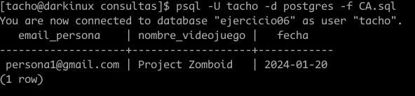
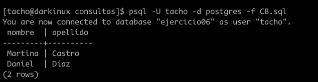
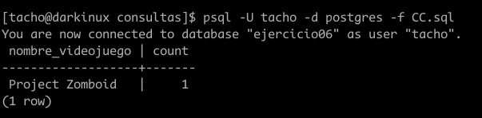
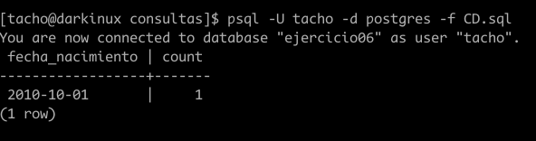

# Consultas del `ejercicio06`

## Dado un usuario, consultar cuál fue su último juego jugado.
### consulta
```SQL
\c ejercicio06

SELECT * FROM juega
WHERE email_persona = 'persona1@gmail.com' 
and fecha =(
    SELECT MAX(fecha)
    FROM juega
    WHERE email_persona = 'persona1@gmail.com' 
);

```
### resultado


## Dado un usuario, conocer el nombre y apellido de cada uno de sus amigos.
### consulta
```SQL
\c ejercicio06

SELECT nombre, apellido 
FROM persona   
WHERE email in (

    SELECT email_amigo 
    FROM amigos 
    WHERE email_persona = 'persona1@gmail.com'

);
```
### resultado



## Dado un videojuego, conocer cuántos jugadores lo han jugado.
### consulta
```SQL
SELECT nombre_videojuego, COUNT(*)
FROM juega   
WHERE nombre_videojuego = 'Project Zomboid'
GROUP BY nombre_videojuego;
```
### resultado 


## Agrupar la consulta (c) por edad de los jugadores.
No se me ocurre como calcular la edad a partir de un date, no se como hacaerlo en sql.
### consulta
```SQL
\c ejercicio06
SELECT fecha_nacimiento, COUNT(*)
FROM persona    
WHERE email IN (
    SELECT email_persona 
    FROM juega 
    WHERE nombre_videojuego = 'Project Zomboid'
)
GROUP BY fecha_nacimiento;
```
### resultado


## Agrupar la consulta (c) por mayores y menores de edad

Como no pude calcular la edad de las personas, no puedo realizar esta consulta

## Conocer cuál es el videojuego con mayores ganancias asociadas. Tener en cuenta las expansiones.

