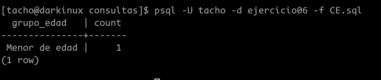
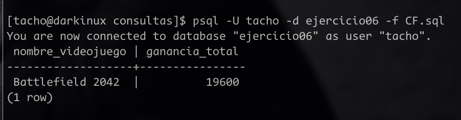
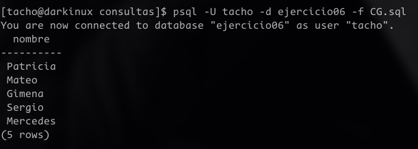
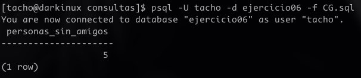
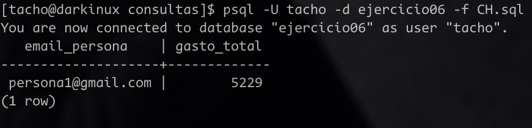
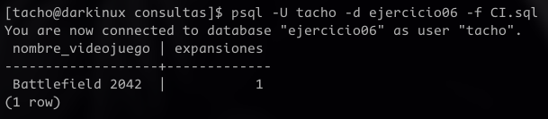
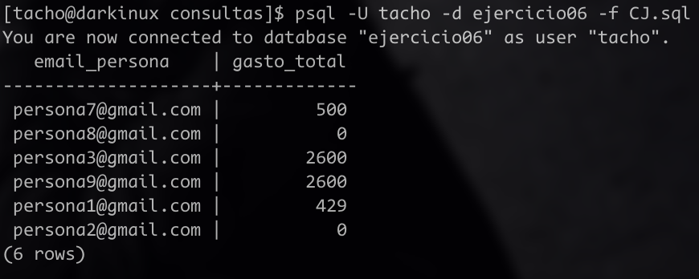

# Consultas del `ejercicio06`

## Dado un usuario, consultar cuál fue su último juego jugado.
### consulta
```SQL
\c ejercicio06

SELECT * FROM juega
WHERE email_persona = 'persona1@gmail.com' 
and fecha =(
    SELECT MAX(fecha)
    FROM juega
    WHERE email_persona = 'persona1@gmail.com' 
);

```
### resultado


## Dado un usuario, conocer el nombre y apellido de cada uno de sus amigos.
### consulta
```SQL
\c ejercicio06

SELECT nombre, apellido 
FROM persona   
WHERE email in (

    SELECT email_amigo 
    FROM amigos 
    WHERE email_persona = 'persona1@gmail.com'

);
```
### resultado


## Dado un videojuego, conocer cuántos jugadores lo han jugado.
### consulta
```SQL
SELECT nombre_videojuego, COUNT(*)
FROM juega   
WHERE nombre_videojuego = 'Project Zomboid'
GROUP BY nombre_videojuego;
```
### resultado 


## Agrupar la consulta (c) por edad de los jugadores.
No se me ocurre como calcular la edad a partir de un date, no se como hacaerlo en sql.
### consulta
```SQL
\c ejercicio06
SELECT fecha_nacimiento, COUNT(*)
FROM persona    
WHERE email IN (
    SELECT email_persona 
    FROM juega 
    WHERE nombre_videojuego = 'Project Zomboid'
)
GROUP BY fecha_nacimiento;
```
### resultado


## Agrupar la consulta (c) por mayores y menores de edad

Al principio no pude completar la consulta anterior por edad, pero luego de investigar como se hacía en postgreSQL me dí cuenta que era más fácil de lo que parecía. Simplemente haciendo algunos cambios en la consulta obtenia el resultado deseado: 

```SQL
SELECT EXTRACT(YEAR FROM AGE(fecha_nacimiento)) AS edad, COUNT(*)
FROM persona
WHERE email IN (
    SELECT email_persona
    FROM juega
    WHERE nombre_videojuego = 'Project Zomboid'
)
GROUP BY edad;
```
Es así que ahora se puede filtrar por mayores y menores de edad de la siguiente manera: 

```SQL
SELECT 
    CASE 
        WHEN EXTRACT(YEAR FROM AGE(fecha_nacimiento)) >= 18 THEN 'mayor de edad'
        ELSE 'Menor de edad'
    END AS grupo_edad, Count(*)
FROM persona
WHERE email IN (
    SELECT email_persona
    FROM juega
    WHERE nombre_videojuego = 'Project Zomboid'
)
GROUP BY grupo_edad;
```
y este fue el resultado: 



Tuve que buscar información acerca del `CASE` y vi que su estructura es similar a un `IF` y sirve para dividir en casos la consulta.

## Conocer cuál es el videojuego con mayores ganancias asociadas. Tener en cuenta las expansiones.
Como decidí separar las tabla `compra` en `compra_videojuego` y `compra_expansiones` esta consulta me fue muy compleja de hacer. 

### Encontrar las mayores ganancias sin contar expansiones
para esto realize la siguiente consulta: 
```SQL
SELECT 
    nombre_videojuego, 
    SUM(valor) AS ganancias_totales

FROM 
    compra_videojuego
GROUP BY 
    nombre_videojuego
ORDER BY 
    ganancias_totales DESC

Limit 1;
```

lo que funcionó así que hice lo mismo para las expansiones: 

```SQL
Select nombre_expansion, SUM(VALOR) AS ganancias_totales

FROM compra_expansiones 

GROUP BY nombre_expansion

Order BY ganancias_totales DESC 

LIMIT 1;


```

### Junto e misturado 
Ahora mi desafio fue fucionar estas consultas en una misma tabla. Para esto tuve que aprender a hacer una tabla temporal de la siguiente manera: 

```SQL
WITH ganancias_totales AS (

    SELECT 
        nombre_videojuego, 
        SUM(valor) AS ganancia
    FROM compra_videojuego
    GROUP BY nombre_videojuego

    UNION ALL

    Select 
        EXPANSIONES.nombre_videojuego, 
        SUM(compra_expansiones.VALOR) AS ganancias_totales
    FROM 
        compra_expansiones 
    JOIN 
        EXPANSIONES ON compra_expansiones.nombre_expansion = EXPANSIONES.nombre
    GROUP BY 
        EXPANSIONES.nombre_videojuego

)

```

`UNION ALL` hace la union entre las dos consultas de los selectformando una tabla que contiene todas las ganancias de expansiones y videojuegos pero en vez de poner el nombre de la expansión, puse que se usara el nombre del videojuego de la que es parte. Esto lo hago para que me resulte facil agrupar por nombre mas adelante. 

Para terminar realize la siguiente consulta usando la tabla que generé.

```SQL
SELECT
    nombre_videojuego
    SUM(ganancia) a ganancia_total
FROM
    ganancias_totales
GROUP by
    nombre_videojuego
ORDER BY
    ganancia_total DESC LIMIT 1;
```
el resultado fue el siguiente: 



## Saber si hay personas que aún no hayan indicado amistad con otro usuario.
Pense en usar una lógica negativa, fijarme las personas que no aparecen en la tabla `amigos` y despues encontrar sus nombres de la siguiente manera
### Consulta
```SQL

SELECT nombre
FROM persona   
WHERE email NOT IN (
    SELECT email_persona
    FROM amigos
);
```
### Resultado 


y si quisieramos saber cuatas personas no tienen amigos: 

### Consulta


``` SQL
\c ejercicio06

SELECT count(*) as personas_sin_amigos
FROM persona   
WHERE email NOT IN (
    SELECT email_persona
    FROM amigos
);
```
### Resultado



## Dado un usuario, saber cuánto dinero ha invertido en videojuegos y expansiones.

la lógica es parecida a la consulta de las ganancias totales 
### Consulta
```SQL

\c ejercicio06
WITH gastos_totales AS(
    SELECT 
        email_persona, 
        SUM(valor) AS gasto
    FROM 
        compra_videojuego
    GROUP BY 
        email_persona

    UNION ALL
        
    SELECT 
        email_persona,
        SUM(valor) AS gasto
    FROM 
        compra_expansiones  
    GROUP BY 
        email_persona  


)

SELECT 
    email_persona, 
    SUM(gasto) AS gasto_total
FROM 
    gastos_totales
WHERE 
    email_persona = 'persona1@gmail.com'
GROUP BY 
    email_persona;


```
### Resultado 
Me generé una tabla `gastos_totales` en donde agrupe por persona los gastos que habían hecho en las tablas `compra_expansiones` y `compra_videojuego` para luego seleccionar el email de la persona y cuando había gastado en total.



## Devolver la cantidad de expansiones por videojuego
esta consulta vuelve a ser relativamente mas sencilla que la anterior

### Consulta 

```SQL
\c ejercicio06

SELECT 
    nombre_videojuego, 
    count(*) AS expansiones
from 
    Expansiones
GROUP BY 
    nombre_videojuego

```
### Resultado




## Devolver el total gastado por cada usuario en videojuegos, ordenándolos por el monto total.

### Consultas
```SQL
SELECT 
    email_persona, 
    SUM(valor) as gasto_total
FROM 
    compra_videojuego
GROUP BY 
    email_persona
```

### Resultado 



