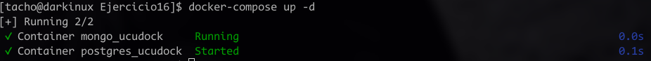
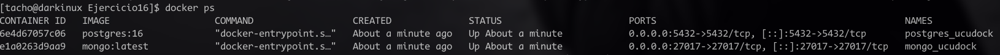
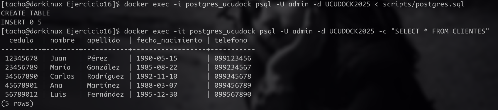
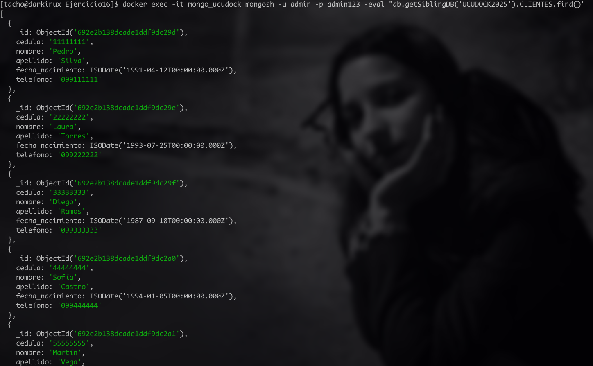

# Ejercicio 16
Estudiante: Silva, Ignacio

Universidad Católica

Asignatura: Bases de datos I

Docente: Jorge Martínez

Fecha: 1 de diciembre de 2025


# Preparar el entorno
## Instalar docker
Lo primero que tenemos que hacer es instalar  `docker` y `docker-compose`. En Arch, basta con un comando:

```bash
sudo pacman -S docker docker-compose
```

## Habilitar el servicio
Similar a otros servicios: 
```bash
sudo systemctl start docker
sudo systemctl enable docker
```

y para no tener que estar escribiendo siempre sudo: 
```bash
sudo usermod -aG docker $USER
```


## Levantar las imagenes y correr ambos contenedores
para este paso, le pedi a una IA que me generara un yml de configuración para ambos. [archivo.yml](docker-compose.yml)

Para esto usé el siguiente comando:
```bash
docker-compose up -d
```
### y este fué el resultado:


### Problema
Cómo se puede ver, la imagen de postgress pulleo con exito pero la de mongo no debido a la mal configuración de los puertos, pues puse uno que ya estaba ocupando al tener mongodb corriendo ya en mi sistema.

### Solución
Para solucionar esto, detuve el servicio de mongo: 

```bash
sudo systemctl stop mongodb
```

y luego ejecute denuevo el comando para levantar los contenedores. 

### Resultado: 



y para asegurarnos que los puertos y las imagenes están bien configuradas: 

```bash
docker ps
```



## Insertar valores en Postgres
Una vez el contenedor está levantado, puedo utilizar los comandos de postgres y por ende cargar lo que pide el ejercicio utilizando este [script](scripts/postgres.sql).

La sintaxis para hacerlo es la misma de siempre solo que debo agregar `docker exec -i postgres_ududock`. la opción `-i` le dice a docker que este esuchando y pueda leer el archivo que tengo en mi repositorio. 

Con todo esto en mente, el comando para esto sería: 

```bash
docker exec -i postgres_ucudock psql -U admin -d UCUDOCK2025 < scripts/postgres.sql
```

o de forma genérica

```bash
docker exec -i <NOMBRE_CONTENEDOR> psql -U <USUARIO> -d <BASE_DATOS> < <RUTA_DEL_SCRIPT>
```
### Resultado 
ejecutando el comando y comprobando si estan cargados mediante una consulta:




Algo a destacar es que para la consulta uso la opción `it` que le dice a docker que voy a interactuar. 

## Insertar valores en Mongo
El proceso es análogo a postgres, solo que con la sintaxis de mongo.

### Resultado





