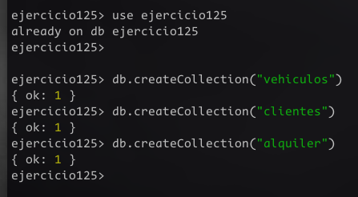
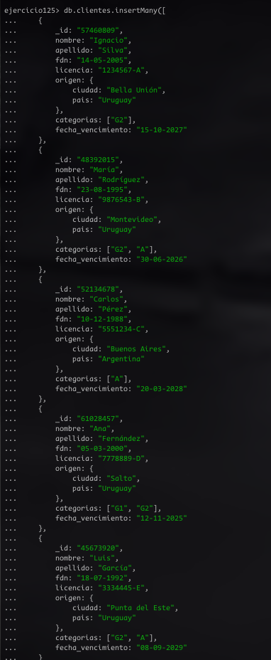
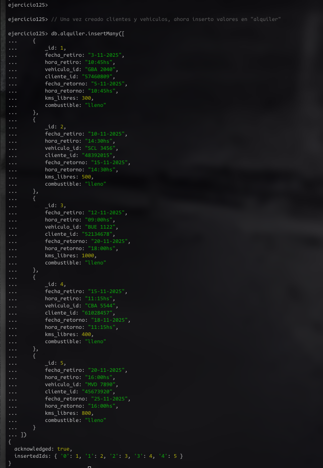
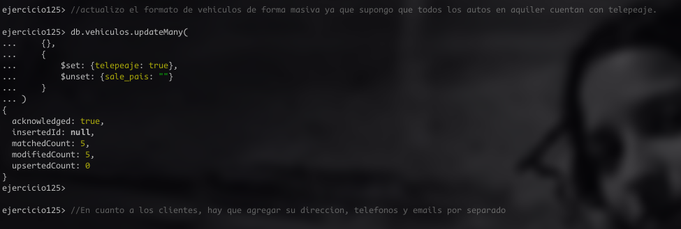
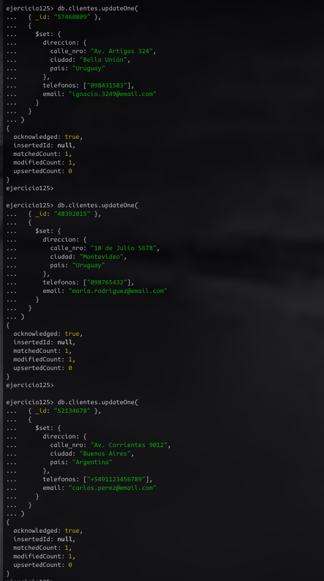
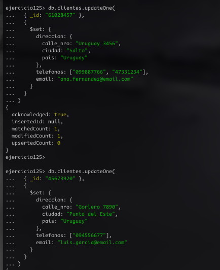

# Ejercicio 12.5

Estudiante: Silva, Ignacio

Universidad Católica

Asignatura: Bases de datos I

Docente: Jorge Martínez

Fecha: 9 de noviembre de 2025

## Scripts en `mongoBD`
Para usar scripts en mongodb hay varias formas. Podemos usar `Batchs`, conectarnos a la base de datos desde algún lenguaje de programación o usar archivos `.js`. Por simplicidad, seleccioné esta última opción.

### ¿Cómo ejectuar un scripts en mongo?
Para poder ejecutar la serie de instrucciones se debe ejectuar el siguiente comando desde la terminal o el cli de compas: `mongosh [nombre de la base de datos] < [nombre del script]`

## 1. Crear colecciones
Para esta primera parte se pedía crear 3 colecciones: 

1. Vehiculos
2. Clientes
3. Alquileres

para eso realicé el siguiente script: [Script de creación](scripts/createCollections.js)

### Ejecutar el script
Para comprobar su funcionamiento, ejecute el siguiente comando: `mongosh ejercicio125 < createCollections.js`
y este fué el resultado: 

## 2. Insertar documentos

En este paso la consigna pedía que insertara 5 documentos para cada colección creada anteeriormente, teninedo cuidado que los objetos referenciados en alquileres, realmente existan en sus respectivas colecciones. 

Para esto realicé el siguiente script: [Script de Insertar](scripts/insertDocuments.js)

### Ejecutar el script
Para comprobar su funcionamiento, ejecute el siguiente comando: `mongosh ejercicio125 < insertDocuments.js`
y este fué el resultado: 

## 3. Actualizar estructura y campos
En la 3era parte del ejercicio se debe modificar la estructura de los documentos, eliminado y añadiento un campo en la colleción vehículos. Además, en la colección clientes, se debe añadir información para cada uno. 

Para completar esta parte de la consigna realicé el siguiente script: [Script de actualización](scripts/updateDocuments.js)  

### Ejecutar el script
Para comprobar su funcionamiento, ejecute el siguiente comando: `mongosh ejercicio125 < updateDocuments.js`
y este fué el resultado: 

