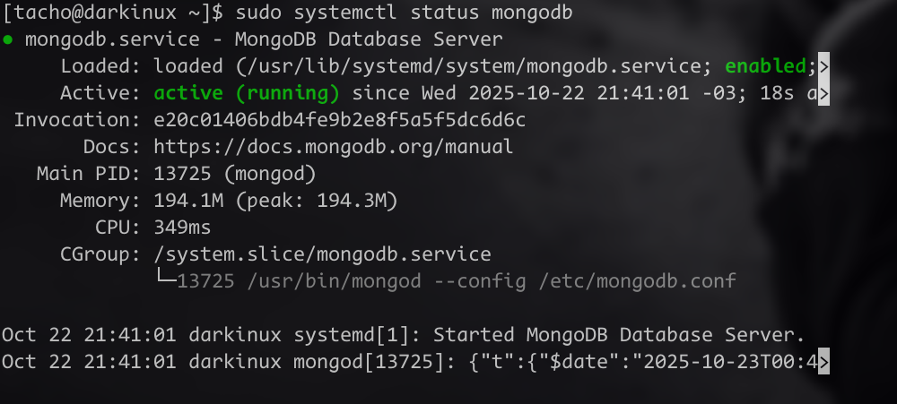
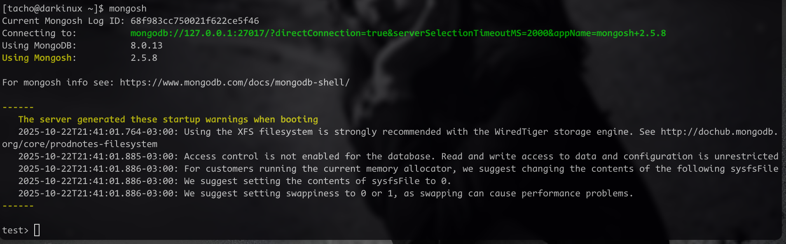

# Ejercicio 12

Estudiante: Silva, Ignacio

Universidad Católica

Asignatura: Bases de datos I

Docente: Jorge Martínez

Fecha: 22 de Octubre de 2025

## Instalación en Arch linux
Para instalar `mongodb` en `Arch Linux` lo primero que intente fue instalarlo usando `pacman -S mongodb` pero no se encuentra en esos repositorios. Luego use los repositorios [Aur](https://markdownlivepreview.com/). usando `yay -S mongodb`

Tuve problemas ya que no tenia las herramientras de instalacion de python, a si que instale los paquetes que me saltaban como missing usando: `sudo pacman -S python-build python-installer python-setuptools python-wheel`. Luego reintente el comando y no tuve problemas.

### Configuración
El post-install fue el de siempre al instalar una herramienta. Activar el servicio y demás rutinarias: 
1. `sudo systemctl start mongodb`
2. `sudo systemctl enable mongodb`
3. `sudo systemctl status mongodb`

Este último nos dirá si salió todo bien: 

Una vez hecho esto podemos empezar a usar mongo con el comando `mongosh`
### Warnings

en la captura se muestras distintas recomendaciones de configuración. Esos serán mis siguientes pasos para una instalación más limpia.

