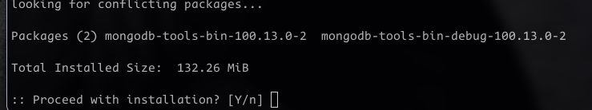
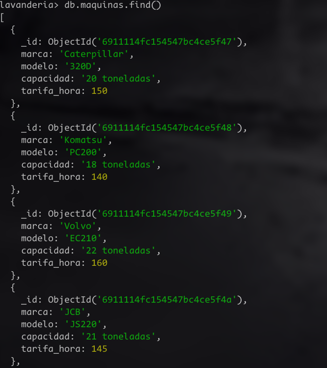
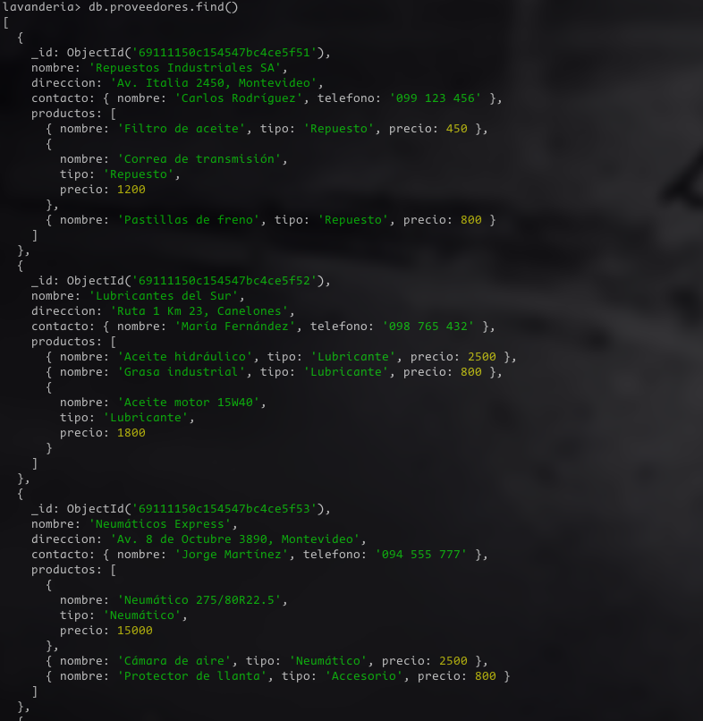
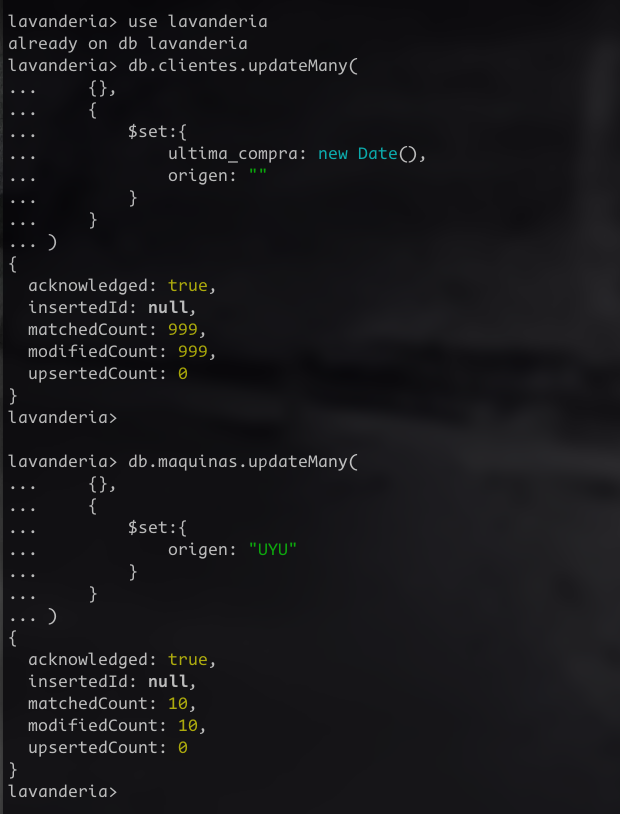
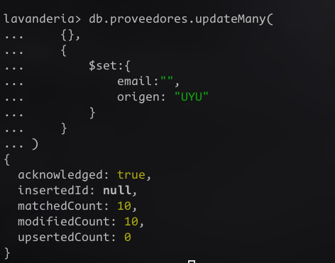
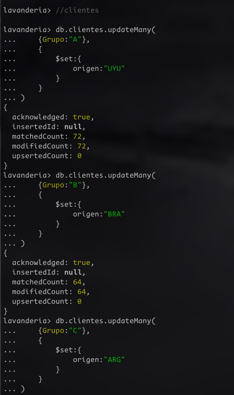
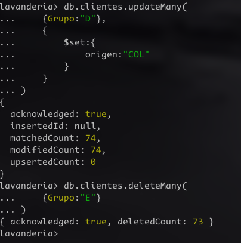
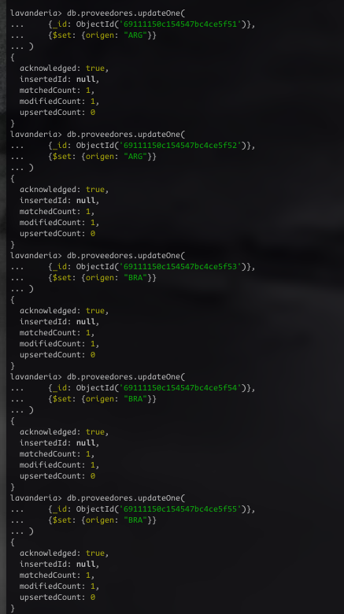
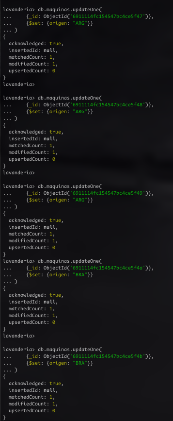

# Ejercicio 13

Estudiante: Silva, Ignacio

Universidad Católica

Asignatura: Bases de datos I

Docente: Jorge Martínez

Fecha: 9 de noviembre de 2025

## ¿Cómo importar un csv a una collection?
Lo primero que debemos hacer, luego de crear las collecciones con el siguiente script: [Script de creación](scripts/createCollections.js). Ahora que tenemos creada la colección `clientes` podemos intentar importar los datos desde nuestro csv.

### Mongoimport
Para hacerlo desde la terminal se debe contar con el paquete `mongoimport` que viene incluido en el paquete `mongo-tools`. En mi caso, no lo tenía instalado y tuve que instalarlo desde los repositorios de la comunidad. <br>


### Importar csv
Una vez instaladas las tools, ya podemos utilizar `mongoimport` con la siguiente sintaxis: `mongoimport --db [nombre de la bd] --collection [nombre de la colección objetivo] --type csv --headerline --file [/ruta/al/archivo.csv]`. 

En mi caso, ejecute este comando: 
```
mongoimport --db lavanderia --collection clientes --type csv --headerline --file Ej13_Clientes_fixed.csv
```
Y el resultado fué el siguiente <br>


Cabe aclarar que la primera vez que ejecute el comando tuve problemas ya que no había formateado de manera adecuada el `.csv`. Una de las cosas que hice fue sustituir los `;` por `,`y cambiar `ID` del header por `_id`.

Ahora solo resta comprobar si logramos importar con exito los datos a la colección `clientes`


## Insertar los demas valores en `maquinas` y `proveedores`
En el script para insertar documentos en las colecciones agregue arriba del todo el comando para importar los datos desde el csv. Aquí se puede ver el script. [Insertar documentos](scripts/insertDocuments.js)
<br>
### Resultados
Maquinas:



Proveedores




También cabe aclarar que para generar los datos de manera más agil utilicé inteligencia artifical.

## Modificar valores
Esta parte del ejercicio pide modificar los documents dentro de todas las colecciones que creamos. Realicé el siguiente script para completarlo: [Actualizar Documentos](scripts/updateDocuments.js)

### Resultados




## Parte 5 
Para esta parte, generé otro script:[Parte 5](scripts/parte5.js)

### Resultados  
1. Clientes






2. Proveedores 



3. Maquinas 




 


