# Ejercicio 14

Estudiante: Silva, Ignacio

Universidad Católica

Asignatura: Bases de datos I

Docente: Jorge Martínez

Fecha: 9 de noviembre de 2025

## Update de documentos para preparar todo para el ejercicio
Antes de empezar con las consultas se pide agregar algunos campos a los documentos de la colección clientes que pertenece a la base de datos Lavanderia. Parta eso realicé el siguiente script: [Update script](scripts/updateDocuments.js).  

#### Update grupo A
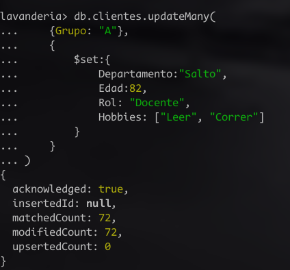

#### Update grupo B
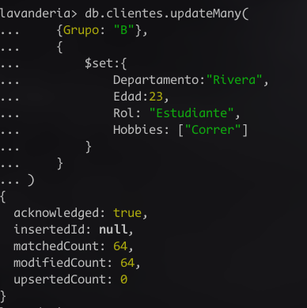

#### Update grupo C
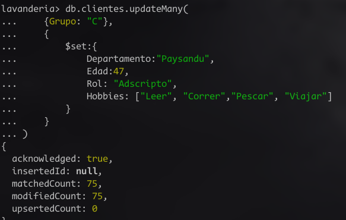

#### Update grupo D
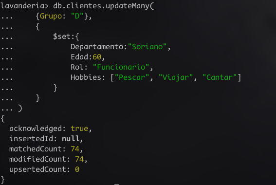


## Consultas
En la carpeta `scripts` de este ejercicio hay dos archivos `.js` de consultas, uno en el que las consultas tiene un `.count()` ya que me pareció mas oportuno usar este método para verificar que estuvieran funcionando en vez de mostrarlas todas explícitamente.
1. Consultas sin count: [aquí](scripts/consultas.js).  
2. Consultas con count: [aquí](scripts/consultasCount.js).  

### Consulta A
#### Código
```js
db.clientes.find({ 
    $or:
    [
        {Departamento:"Soriano"},
        {Departamento:"Rivera"}
    ]
}).count()
```
#### Resultado
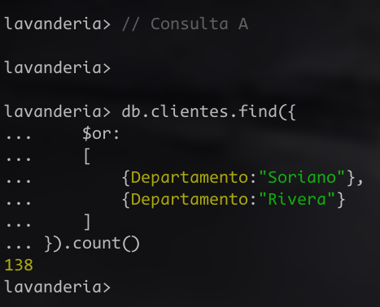

### Consulta B
#### Código
```js
db.clientes.find({ 
    $or:
    [
        {Departamento:"Soriano"},
        {Rol:"Docente"}
    ]
}).count()
```
#### Resultado
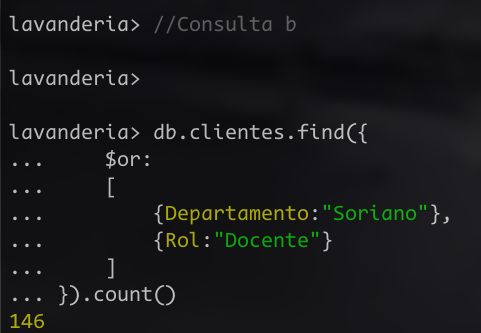

### Consulta C
#### Código
```js
db.clientes.find(
    {Edad: {$gt:25, $lt:65}}
).count()
```
#### Resultado
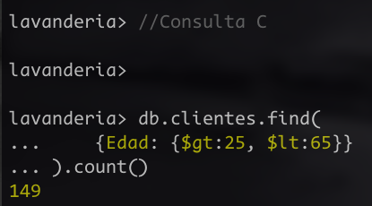

### Consulta D
#### Código
```js
db.clientes.find(
    {Edad:{$lt:25}}
).count()
```
#### Resultado
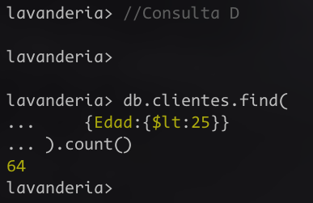

### Consulta E
#### Código
```js
db.clientes.find(
    {Edad:{$gt:80}}
).count()
```
#### Resultado


### Consulta F
#### Código
```js
db.clientes.find({
    $or: 
    [
        {Hobbies: "Leer"},
        {Hobbies: "Cantar"}
    ]
}).count()
```
#### Resultado
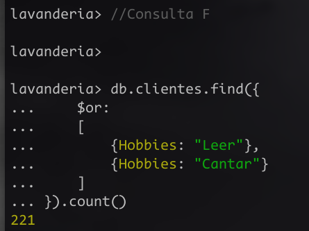

### Consulta G
#### Código
```js
db.clientes.find(
    {
        Hobbies:["Leer", "Correr"]
    }
).count()
```
#### Resultado
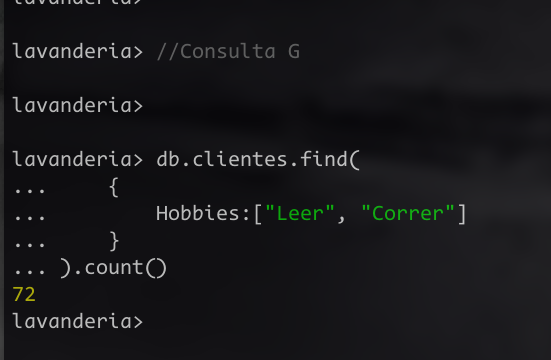

### Consulta H
#### Código
```js
db.clientes.find(
    {
        Hobbies: 
        {
            $all:["Correr"]
        }
    }
).count()
```
#### Resultado
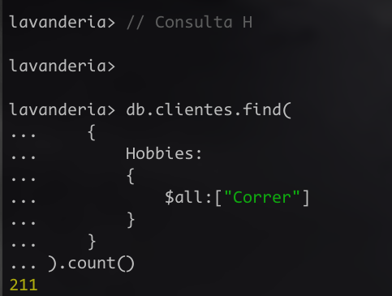


 


