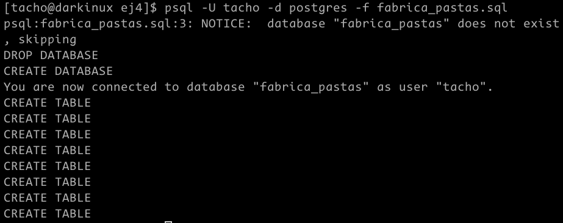

# Ejercicio 04
Estudiante: Silva, Ignacio 

Universidad Católica

Asignatura: Bases de datos I

Docente: Jorge Martínez

Fecha: 14 de septiembre de 2025

# Modelo Lógico
## Fabrica  de pastas
```SQL
    DROP DATABASE IF EXISTS fabrica_pastas;
    CREATE DATABASE fabrica_pastas;

    \c fabrica_pastas;

    CREATE TABLE Persona (
    cedula VARCHAR(8) PRIMARY KEY,
    nombre VARCHAR(30) NOT NULL,
    apellido VARCHAR(30) NOT NULL,
    fechaNacimiento DATE NOT NULL
    );

    CREATE TABLE Direccion (
    idDireccion SERIAL PRIMARY KEY,
    ciudad VARCHAR(30),
    calle VARCHAR(30),
    numero INT,
    cedula_persona VARCHAR(8),
    FOREIGN KEY (cedula_persona) REFERENCES Persona(cedula)
    );

    CREATE TABLE Telefono (
    idTelefono SERIAL PRIMARY KEY,
    numero VARCHAR(20) NOT NULL,
    tipo VARCHAR(10),
    cedula_persona VARCHAR(8),
    FOREIGN KEY (cedula_persona) REFERENCES Persona(cedula)
    );


    CREATE TABLE Cliente (
    cedula_persona VARCHAR(8) PRIMARY KEY,
    FOREIGN KEY (cedula_persona) REFERENCES Persona(cedula)
    );

    CREATE TABLE Vendedor (
    cedula_persona VARCHAR(8) PRIMARY KEY,
    email VARCHAR(30),
    FOREIGN KEY (cedula_persona) REFERENCES Persona(cedula)
    );

    CREATE TABLE Producto (
    codigo INT PRIMARY KEY,
    nombre VARCHAR(30) NOT NULL,
    tipo VARCHAR(30),
    medidas DECIMAL,
    precioUnitario DECIMAL NOT NULL
    );

    CREATE TABLE Pedido (
    num SERIAL PRIMARY KEY,
    fechaHora TIMESTAMPTZ DEFAULT CURRENT_TIMESTAMP,
    importeTotal DECIMAL(10, 2),
    estado BOOLEAN DEFAULT FALSE,
    cedula_cliente VARCHAR(8),
    id_vendedor VARCHAR(8),
    repartidor VARCHAR(8),
    FOREIGN KEY (cedula_cliente) REFERENCES Cliente(cedula_persona),
    FOREIGN KEY (id_vendedor) REFERENCES Vendedor(cedula_persona)
    );

    CREATE TABLE ticketVenta (
    cantidad INT NOT NULL,
    num_pedido INT,
    codigo_producto INT,
    FOREIGN KEY (num_pedido) REFERENCES Pedido(num),
    FOREIGN KEY (codigo_producto) REFERENCES Producto(codigo),
    PRIMARY KEY (codigo_producto, num_pedido)
    );
```

## Empresa de remises
```SQL

DROP DATABASE IF EXISTS empresa_remises;

CREATE DATABASE empresa_remises;

\c empresaremises;

CREATE TABLE PERSONA (
    cedula VARCHAR(8) PRIMARY KEY,
    nombre VARCHAR(30) NOT NULL,
    apellido VARCHAR(30) NOT NULL 
);
        
CREATE TABLE CLIENTES (
    cedula_cliente varchar(8) PRIMARY KEY,
    Email VARCHAR(30) NOT NULL,
    Frecuente BOOLEAN DEFAULT FALSE,
    FOREIGN KEY (cedula_cliente) REFERENCES PERSONA(cedula)
);

CREATE TABLE CONTACTO (
    telefono VARCHAR(13),
    cedula_cliente varchar(8),
    FOREIGN KEY (cedula_cliente) REFERENCES CLIENTES(cedula_cliente),
    PRIMARY KEY (telefono, cedula_cliente)
);

CREATE TABLE CHOFER (
    cedula_chofer varchar(8) PRIMARY KEY, 
    edad INT CHECK (edad >= 21),
    licencia VARCHAR(30) NOT NULL,
    FOREIGN KEY (cedula_chofer) REFERENCES PERSONA(cedula)
);

CREATE TABLE COCHE (
    matricula VARCHAR(7) NOT NULL PRIMARY KEY,
    modelo VARCHAR(50) NOT NULL,
    color VARCHAR(30) NOT NULL, 
    cantidadPasajeros INT CHECK (cantidadPasajeros > 0)
);

CREATE TABLE VIAJE(
    idViaje SERIAL PRIMARY KEY,
    cedula_cliente VARCHAR (8) NOT NULL,
    cedula_chofer VARCHAR(8) NOT NULL,
    matricula VARCHAR (7) NOT NULL,
    fechaHoraSalida TIMESTAMP NOT NULL, 
    fechaHoraLLegada TIMESTAMP NOT NULL,
    costo DECIMAL CHECK (costo >= 0),
    FOREIGN KEY (cedula_cliente) REFERENCES CLIENTES(cedula_cliente),
    FOREIGN KEY (cedula_chofer) REFERENCES CHOFER(cedula_chofer),
    FOREIGN KEY (matricula) REFERENCES COCHE(matricula)
);

CREATE TABLE MANTENIMIENTO(
    idMantenimiento SERIAL PRIMARY KEY,
    matricula varchar(7) NOT NULL,
    fechaActual TIMESTAMPTZ DEFAULT CURRENT_TIMESTAMP,
    ultimoMantenimiento DATE NOT NULL,
    frecuenciaKilometros INT NOT NULL,
    FOREIGN KEY (matricula) REFERENCES COCHE(matricula)
);

```
# ¿Cómo implementar estos scripts `.sql` en Arch Linux?
Lo primero que debemos hacer es instalar postgresql utilizando el siguiente comando: `sudo pacman -S postgresql` y seguir el proceso de configuración de la wiki para arch https://wiki.archlinux.org/title/PostgreSQL

## Ejecutar los scripts
Una particularidad que me dió dolores de cabeza es que, al principio usé `pascal case` para los nombres de las bases de datos pero cuando quería acceder a ellas para agregar tablas usando `\c FabricaPastas` psql me envíaba un mensaje de error diciendo que no existía. Entonces chequié desde el entorno de psql las bases de datos que había creado y encontre que mi "FabricaPastas" ahora era `fabricapastas` así que decidí pasar los nombres a `snake_case`.

### Proceso para ejecutar un script sql desde la terminal de Arch.
Con un `ROLE` (usuarios en postgresql) ya creado y habiendole dado permisos de superusuario y de crear bases de datos. ejecutamos los siguientes comandos: 

```Bash
psql -U nombre_de_tu_usuario -d postgres -f /ruta/del/scripts.sql
```
* psql es el cliente en linea de comandos para PostgreSQL. 
* -d postgres especifica que queremos conectarnos a la base de datos de postgres justamente 
* -f /ruta/del/scripts.sql ejecuta lo que queremos.

#### Ejecutar empresa_remises.sql
en mi caso, no use una ruta absoluta porque estaba en el mismo directorio que mi script:

```Bash
psql -U tacho -d postgres -f empresa_remises.sql
```
##### y obtuve como resultado: 


#### Ejecutar fabrica_pastas.sql

```Bash
psql -U tacho -d postgres -f fabrica_pastas.sql
```
##### resultado: 



